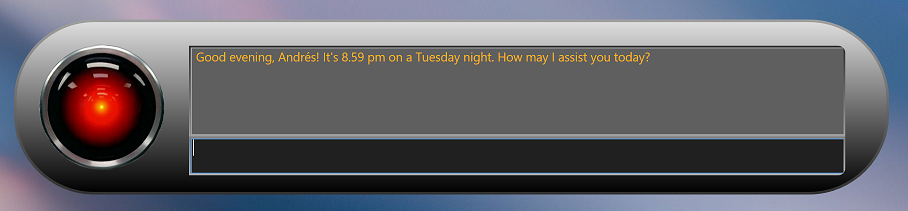
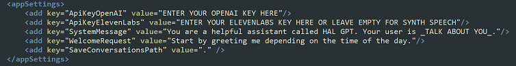
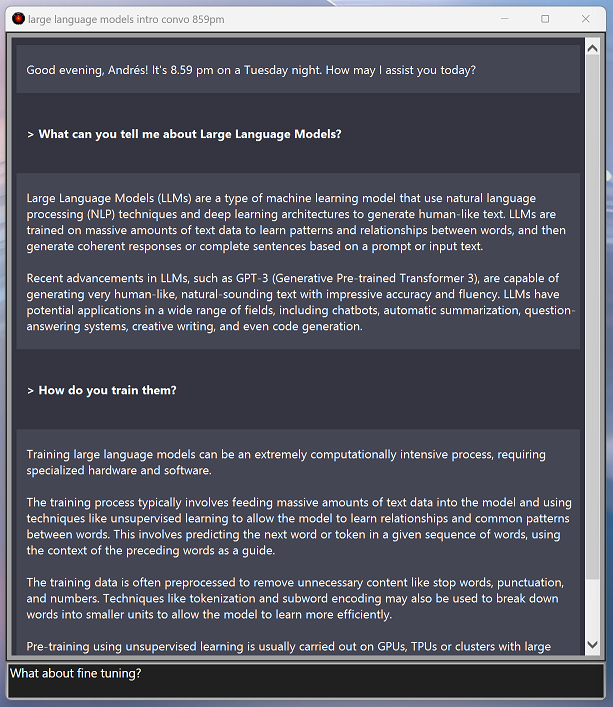

# HalGpt
**HalGPT** is a ChatGPT (GPT 3.5 Turbo) Windows desktop UI (tested in Windows 10 and 11) with speech support and automatic conversation saving on closing. 
Preprogram it to know you and define its personality!
Requires an OpenAI API key and an optional ElevenLabs API key for realistic speech.
No developer knowledge required -just editing a config file.
HalGPT is inspired by HAL 9000 from the novel and movie *2001: A Space Odyssey* -though the default HalGPT behavior is much, much friendlier.

 
*HalGPT expanded* 

# How to set it up the first time
1. Extract the binaries in your hard drive. 
2. Open **HalGpt.exe.config** in a text editor
3. You need an OpenAI API key to use HalGPT. Sign in with your ChatGPT/OpenAI account and go to https://platform.openai.com/account/api-keys to get one. Replace the text ENTER YOUR OPENAI KEY HERE with your key. Note that API keys are free on trial for 3 months but may have a small cost afterwards.
4. [Optional] You can use an ElevenLabs API key to use realistic speech. Go to https://beta.elevenlabs.io/, sign in and retrieve your security key. Replace the text ENTER YOUR ELEVENLABS KEY HERE OR LEAVE EMPTY FOR SYNTH SPEECH with your key in the **ApiKeyElevenLabs** line. ElevenLabs offers a free tier of 10.000 characters per month.
5. If you are not using an ElevenLabs API key, remove the text ENTER YOUR ELEVENLABS KEY HERE OR LEAVE EMPTY FOR SYNTH SPEECH and leave just an empty string: ""
6. Customize the **SystemMessage** to what you would like HalGpt to know about you and how you would like it to behave. 
7. [Optional] Change the **WelcomeRequest** to anything you would like HalGPT to start doing or answering to you every time you open it.
8. [Optional] Change the **SaveConversationsPath** with the path where you would like to automatically save the conversations on closing.

 
*HalGpt.exe.config fragment*

# Some basics on the UI
- If HalGPT is closed Click on the red HAL icon to open it
- Write in the bottom text box to talk to Hal
- If you want to close HalGPT, click outside of the window. 
- You can enable and disable speech in the context menu via mouse right click
- You can double click the conversation pane to open the bigger conversation window -or right click and choose Conversation in the context menu. While in conversation window you cannot use the HalGPT small window.
- To exit, right click -context menu- and choose Exit. HalGPT will automatically save your conversation as HTML in the current directory where it is installed when closing the application, but you can change the location in the config file.

 
*HalGPT collapsed*

 
*HalGPT conversation window*

# Privacy
This application does **_not_** send in any way neither the API keys nor the conversations (except when calling the APIs themselves, of course). 
Please review OpenAI and ElevenLabs privacy policies regarding their privacy in the usage of their APIs.

# Feedback or contributions
Feel free to open Issues or start conversations. I may continue this project depending on general interest.
